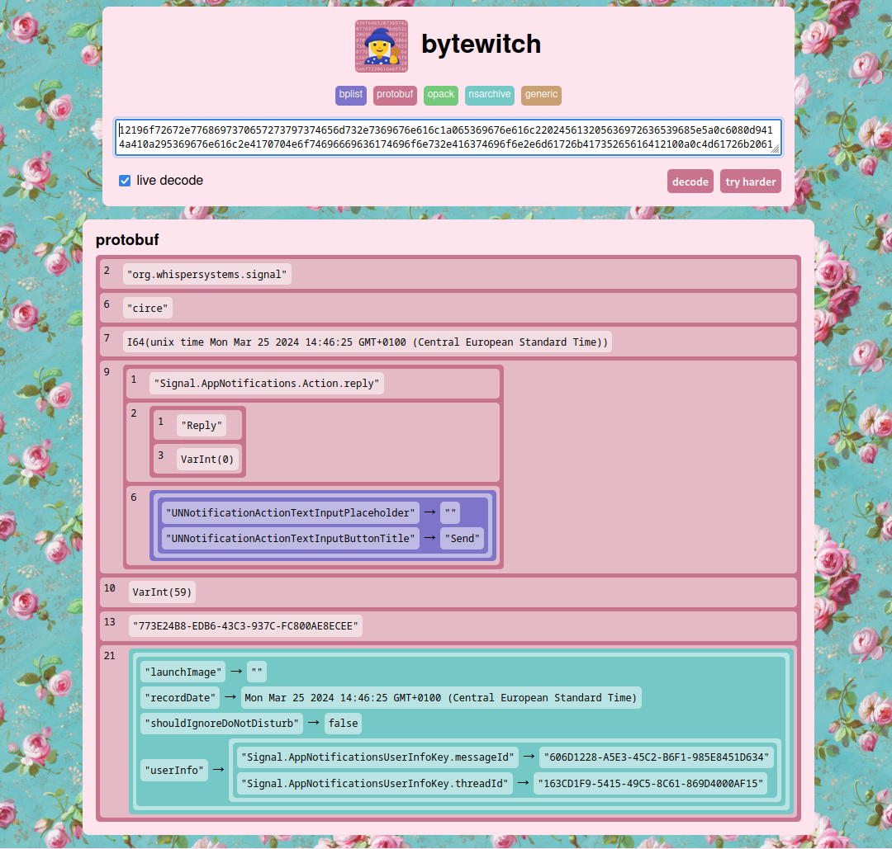

# ByteWitch

Instant, in-browser decoding of arbitrarily nested ProtoBuf, bplist, OPACK payloads and more. 

Give it a try at [rec0de.net/open/bytewitch](https://rec0de.net/open/bytewitch)



---

## Installation & Development Guide

This project is a pure **web application** written in **Kotlin** and compiled to **JavaScript**.  
There is no backend, so all logic runs entirely in the browser.

### Architecture
- **Language:** Kotlin  
- **Target platform:** JavaScript (Kotlin/JS)  
- **Execution:** Everything runs client-side in the browser  
- **Backend:** None, the entire application is delivered as JavaScript  

### Prerequisites
- IntelliJ IDEA (recommended)  
- Gradle (wrapper included, no separate installation required)  

### Run the application
From the project root, execute:

```bash
./gradlew jsBrowserDevelopmentRun
```


This will build the application and open it in your browser.
In the build.gradle.kts file you can configure which browser should be used.

### Run tests
From the project root, execute:

```bash
./gradlew build
```
